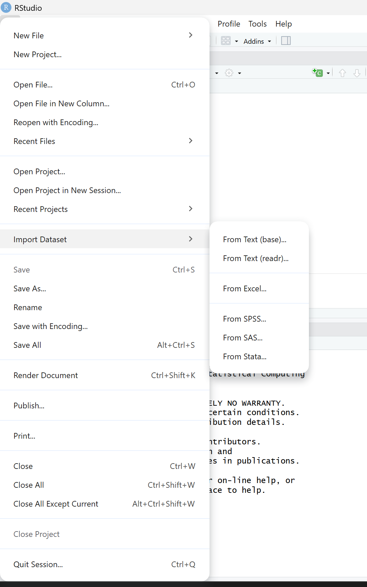
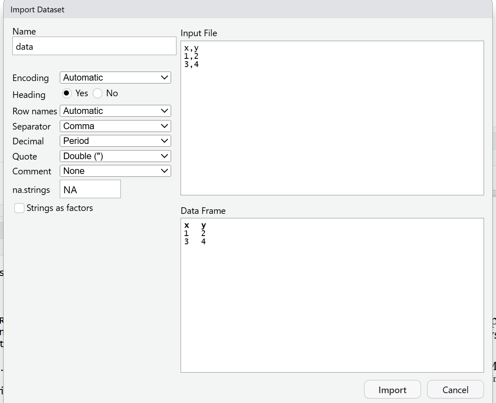
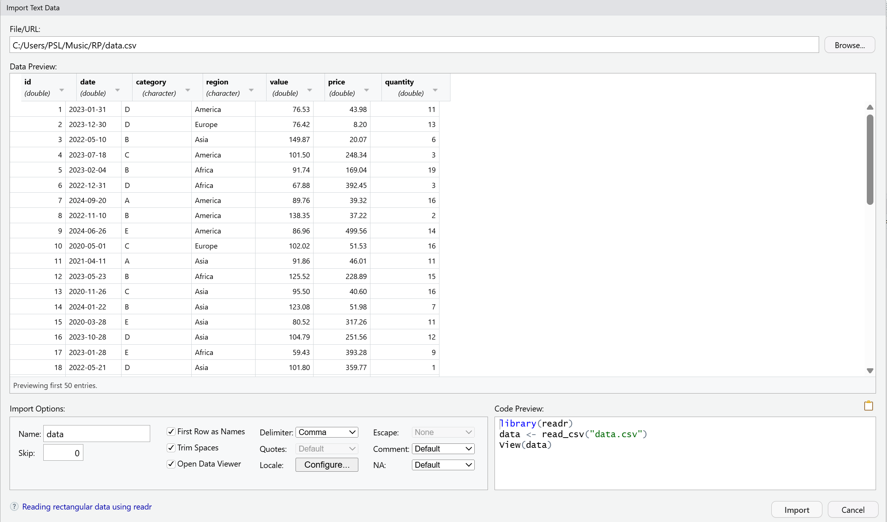
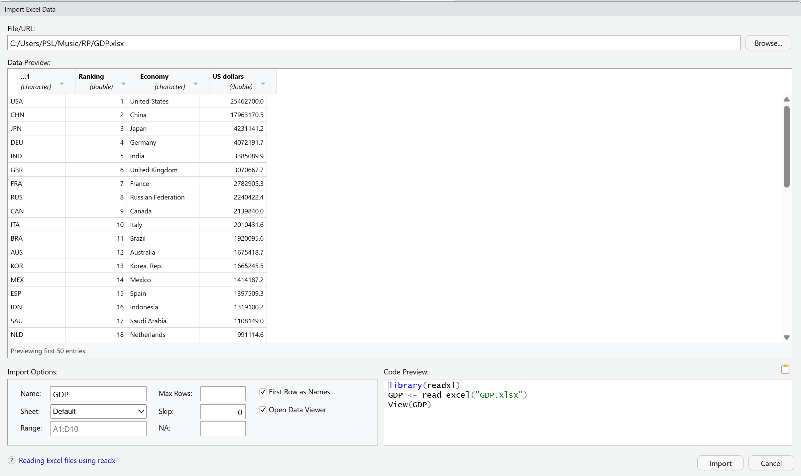
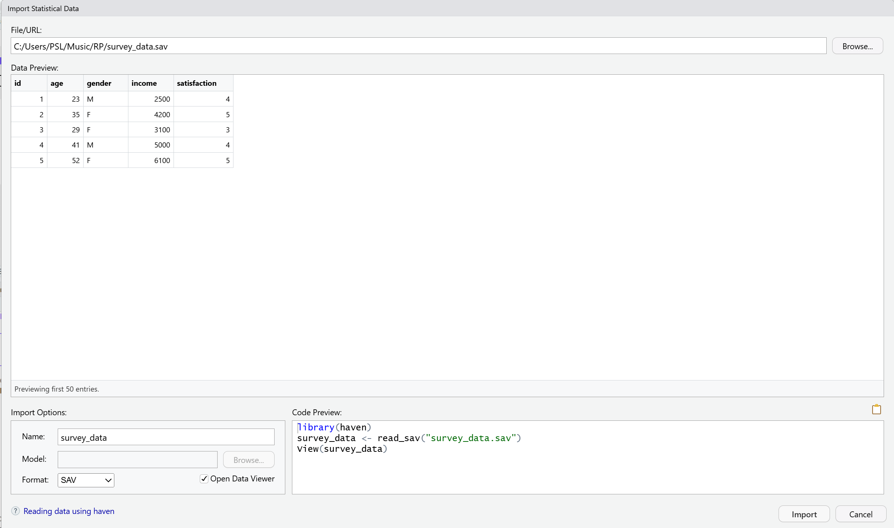

{#fig-qr fig-cap="QRCode"}

# Why Do We Import Data? Why with R?

@wickham2016r explains that in the modern and dynamic report creation procedure, importing data is important to have quick and reliable access to the recent available data. R helps users import data easily and prepare routine reports efficiently. Also data import is the key for starting Data science, which is then followed by tidying data, transforming it, visualizing, and modeling it.

-   **Accessing the "Raw" Reality:** @rcore2015r note that decisions are based on data stored in diverse environments—from simple text files and spreadsheets to massive relational databases and specialized scientific instruments.

-   **The Reproducibility Imperative:** @bivand2008applied explains that a core advantage of using R over "point-and-click" software is reproducibility.

-   **Auditable:** In fields like public health or climate change, where decisions have high stakes, open-source scripts allow every step of the data import and analysis to be audited and checked by others, as explained by @elsevier2019import.

-   **Efficiency and Automation:** Manual data entry or GUI-based exports are prone to human error and are not scalable. @huber2025how describes how R enables the creation of scripts that can be replayed and modified for new datasets with minimal effort, providing a high return on the initial "steep learning curve" investment.

-   **Handling Complexity:** R allows decision-makers to overcome the limitations of traditional software like Excel, particularly when dealing with non-rectangular data, complex encodings, or datasets that exceed standard spreadsheet row limits as discussed by @rcore2015r.

-   **Open-Source Accessibility:** R is free and open-source software, allowing organizations to avoid expensive licensing costs associated with proprietary analytical tools.

# Different Data Types

Before choosing a package, a data scientist must understand the structure of the source material. Data generally falls into several categories:

1.  **Rectangular/Tabular Data:** This is the most common type, where data is organized into rows (observations) and columns (variables). Examples include Comma Separated Values (.csv) and Tab Delimited (.txt or .tsv) files.

2.  **Proprietary Spreadsheets:** Proprietary spreadsheet such as Microsoft Excel (.xls, .xlsx) are widely used in companies. But they are more complicated than plain text files because they can contain multiple sheets, formulas, formatting, and macros, not just raw data.

3.  **Statistical Software Files:** Data often originates from legacy systems like SAS (.sas7bdat), SPSS (.sav), or Stata (.dta). These files often contain important metadata, such as value labels, which must be preserved during import.

4.  **Relational Databases:** For very large-scale data that does not fit into a computer's RAM, data is stored in RDBMS like MySQL, PostgreSQL, or SQLite. Accessing these requires specialized connection protocols @rcore2015r.

5.  **Spatial Data:** Includes coordinates, bounding boxes, and reference systems. These are categorized into vector models (points, lines, polygons) and raster models (regular grids like satellite imagery) @bivand2008applied.

6.  **Scientific/Sensors Data:** Data from instruments like sensors often comes in proprietary formats that require specialized parsers to extract both measurements and critical metadata @gruson2019lightr.

# Different Packages For Each Data Type

R’s ecosystem offers a specialized collection of tools for data acquisition, ranging from built-in Base R functions to the modern, high-performance Tidyverse suite.

@tbl-packages summarizes the primary packages used for various data formats in professional data science workflows.

| Data Category | File Extensions | Primary Functions |
|----|----|----|
| Standard Tabular | `.csv`, `.tsv`, `.txt` | `read_csv`, `read_tsv` |
| Proprietary Excel | `.xls`, `.xlsx` | `read_excel`, `excel_sheets` |
| Statistical Files | `.sav`, `.sas7bdat`, `.dta` | `read_sas`, `read_sav`, `read_dta` |
| Relational DBs | `.db`, `.sqlite`, `.mdb` | `dbConnect`, `dbGetQuery` |
| Spatial / GIS | `.shp`, `.tif`, `.kml` | `st_read` |
| Base Text | `.txt`, `.dat`, `.fwf` | `read.table`, `read.csv`, `read.fwf` |
| Scientific Data | `.jdx`, `.abs`, `.cnv`, `.nc` | `lr_get_spec` |
| Cloud Sheets | URL | `read_sheet` |
| Hierarchical Data | `.json` | `fromJSON` |

: Overview of data import packages {#tbl-packages}

# Graphical and Programmatic Implementation by Data Type

This section details the practical application of the tools identified in the previous pages. For each category, we contrast the Graphical User Interface (GUI) approach—often best for initial exploration—with the Programmatic R Code required for reproducible scripts.

## Standard Tabular Data (.csv, .tsv)

-   **Graphical:** In Rstudio, click on File → Import dataset, then you can see two options for importing text file, as shown in the @fig-1.

{#fig-1 fig-cap="Opening Import section in R studio" width="50%"}

Then You can then choose between the Base R and `readr` import options. The base import option (see @fig-2) uses Base R functions, which are generally slower for large datasets. However, the `readr` package, which is part of the `tidyverse` ecosystem (see @fig-3), provides a user-friendly interface with a live preview option.

{#fig-2 width="50%"}

{#fig-3 width="50%"}

-   **Code** :

From text Base

```{r, eval=FALSE}
df_base <- read.csv("data.csv")
df_base
```

From text readr

```{r, eval=FALSE}
library(readr)
df_readr <- read_csv("data.csv")
df_readr
```

## Proprietary Excel Files (.xls, .xlsx)

For Excel files, you have to install a package. The `readxl` package from the `tidyverse` ecosystem is commonly recommended for importing Excel files.

-   **Graphical:** Select "From Excel" in the RStudio wizard. Then you will see a window like @fig-4 and you can select from which sheet you want to import data, and also define a cell range (e.g., "A1:E20") graphically.

{#fig-4 width="50%"}

-   **Code** according to @chapman2026importing:

```{r, eval=FALSE}
library(readxl)
df_excel <- read_excel("file.xlsx")
df_excel
```

## Statistical Software Files (.sav, .sas7bdat, .dta)

-   **Graphical:** Click on File → Import Dataset → From SPSS/SAS/Stata in RStudio. After selecting the file, you will see a window like @fig-5.

{#fig-5 width="50%"}

-   **Code** according to @rcore2015r:

    ```{r, eval=FALSE}
    library(haven)
    # Import SPSS file
    df_spss <- read_sav("survey_data.sav")
    # Import Stata file
    df_stata <- read_dta("economic_data.dta")
    # Preview imported data
    head(df_spss)
    head(df_stata)
    ```

## Relational Databases (.db, .sqlite, .mdb)

-   **Graphical:** Access through the RStudio "Connections" pane. Once a DBI connection is established, you can browse table schemas and preview data before importing.

-   **Code** according to @rcore2015r:

    ```{r, eval=FALSE}
    library(DBI)
    library(RSQLite)
    # Connect to SQLite database
    con <- dbConnect(RSQLite::SQLite(), "company.db")
    # Read table
    df_db <- dbGetQuery(con, "SELECT * FROM employees")
    # Show data
    df_db
    # Disconnect
    dbDisconnect(con)
    ```

## Spatial / GIS Data (.shp, .tif, .kml)

-   **Code** The following example is adapted from @bivand2008applied :

    ```{r, eval=FALSE}
    library(sf)
    # Read shapefile
    spatial_data <- st_read("sample_shapefile.shp")
    # Preview spatial object
    print(spatial_data)
    ```

## Base Text and Fixed-Width Files (.txt, .dat, .fwf)

-   **Graphical:** Use the "From Text (base)" option in the RStudio wizard.

-   **Code** according to @rcore2015r:

    ```{r, eval=FALSE}
    # Import fixed-width file
    df_fwf <- read.fwf(
      "legacy_data.fwf",
      widths = c(3, 6, 5),
      col.names = c("ID", "Name", "Score")
    )

    df_fwf
    ```

## Scientific Spectral Data (.jdx, .abs, .cnv, .nc)

-   **Graphical:** Utilize specialized package GUIs or high-level functions that automate folder-wide imports, as mentioned by @gruson2019lightr.

-   **Code:**

    ```{r, eval=FALSE}
    library(lightr)

    # Import spectral data
    spec_data <- lr_get_spec("spectrum.jdx")

    # Show spectral data
    head(spec_data)
    ```

## Cloud Sheets (Google Sheets/ URLs)

-   **Code:** The following example is adapted from @chapman2026importing

    ```{r, eval=FALSE}
    library(googlesheets4)
    # Import Google Sheet
    gs4_deauth()
    sheet_data <- read_sheet(
      "https://docs.google.com/spreadsheets/d/1BoD9bXwbxm1NJWhEnk6BVXUxuxWbWArQWVT3LIKk2PQ/edit?gid=827746275#gid=827746275"
    )

    sheet_data
    ```

## Hierarchical Data (.json)

-   **Graphical:** While RStudio does not have a dedicated "JSON Wizard" in the same way it does for Excel or CSV, users can often preview JSON structures through the File Pane or by using specialized viewing packages.

-   **Code:** see @rcore2015r

```{r, eval=FALSE}
library(jsonlite)
df_json <- fromJSON("data.json")
df_json
```

## Importing Data From Multiple Files

Decision-makers often face the need to import hundreds of files simultaneously. R provides several automation strategies @wickham2016r, @gruson2019lightr.

-   **Automated Recursive Import:** Specialized tools like lightr use functions such as `lr_get_spec()` to search subfolders automatically for specific extensions and process them using parallelized loops to reduce processing time @gruson2019lightr.

-   **The Tidyverse Approach (Iteration):** The most flexible method combines `list.files()` with the purrr package. By using `map()` or `map_df()`, an analyst can apply a read function to every path in a list, automatically stacking them into a single unified tibble @wickham2019welcome.

-   **Complex Multi-File Formats:** Some formats are naturally batch-oriented. For example, a shapefile is composed of several related files (`.shp`, `.dbf`, `.shx`, etc.). The `st_read()` function from the `sf` package can automatically import these files as a single spatial object. @bivand2008applied, @rcore2015r.

-   **Custom Functions for Productivity:** speedR can graphically define an import process and then generate a new R function containing those specific constraints. This "ready-to-use" code can be applied to any number of similar files to ensure a consistent pipeline @visne2012speedr.

# The Comparison Between Packages

Selecting the appropriate import method is a strategic decision that impacts the speed, reliability, and reproducibility of the analytical pipeline. @tbl-comparison provides a side-by-side comparison of the key packages discussed in this handnote to help users choose the right tool based on the specific data requirements.

| Data Category | File Formats | Recommended Package | Key Function | Graphical Method (GUI) | Main Advantage / Limitation |
|----|----|----|----|----|----|
| Tabular Data | **`.csv`**, **`.tsv`**, **`.txt`** | readr | read_csv() | Import Dataset -\> From Text (readr) | Very fast import; creates tibbles / Limited by RAM. |
| Excel Sheets | `.xls`, `.xlsx` | readxl | read_excel() | Import Dataset -\> From Excel | No Java required; supports multiple sheets / Limited scalability. |
| Statistical Files | `.sav`, `.dta`, `.sas7bdat` | haven | `read_sav()`, `read_dta()` | Import Dataset -\> From SPSS/Stata | Preserves labels and metadata / Limited newest-version support. |
| Databases (SQL) | `.db`, `.sqlite`, MySQL | DBI | `dbConnect()`, `dbGetQuery()` | RStudio "Connections" Pane | Handles large datasets / Requires SQL knowledge. |
| Spatial / GIS | `.shp`, `.tif`, `.kml` | sf | `st_read()` | External links (e.g., GRASS) | Supports CRS metadata / Complex for beginners. |
| Hierarchical (Web) | .json | jsonlite | fromJSON() | N/A (Script-based) | Standard for APIs and JSON / Nested data can be complex. |
| Batch Import | Multiple Files | purrr or lightr | `map()`, `lr_get_spec()` | N/A (Script-based) | Automates multi-file import / Requires functional programming. |
| Cloud Services | Google Sheets | googlesheets4 | read_sheet() | N/A | Direct cloud access / Requires OAuth authentication. |

: The Comparison Between Packages {#tbl-comparison}

**Key Decision-Making Guidelines for the Presentation:**

-   **The Reproducibility Standard:** While graphical tools like the RStudio Wizard are excellent for initial exploration, final decision-making workflows should always use programmatic scripts to ensure every step is auditable and repeatable @bivand2008applied, @huber2025how.

-   **Memory Management:** For datasets larger than 2GB, avoid standard flat-file imports and prioritize database connections or optimized import methods to prevent system crashes @rcore2015r, @wickham2016r.

-   **Structure Alignment:** Always select the package that best respects your data's inherent structure. For example, use haven for surveys to avoid losing categorical labels, or lightr for scientific spectrometry to preserve instrument metadata @luraschi2023importing, @gruson2019lightr.

# Conclusion

Mastering data import is about matching the right package to the right data structure while considering hardware limits. Choosing programmatic scripts ensures that the decision-making process is transparent, scalable, and reproducible @bivand2008applied, @huber2025how.

# Class Assignment

Download all 3 files from here [link](https://drive.google.com/file/d/17co85tSnV84tRCVxreNODKs_2N6F92Xc/view?usp=sharing){.uri} or you can access them individually, inside each exercise description.

## Help The HR Manager!

1.  Your HR manager is importing personnel database every month and it is a real pain for her to create the report every time from it! She asks you to prepare a dynamic report by importing the data into R, so she can easily prepare reports more efficiently. Go ahead and do first step which is importing the [exe1.csv](exe1.csv) file into R Studio.

## Everyday Sales Report!

2.  You are a manager in a company and the sales department gives you sales reports in excel file every morning. consider that you have received [exe2.xlsx](#0) file today. Import it to Rstudio.

3.  Imagine that you and your colleagues in the company are working on a Google spreadsheet ([Link](https://docs.google.com/spreadsheets/d/1BoD9bXwbxm1NJWhEnk6BVXUxuxWbWArQWVT3LIKk2PQ/edit?usp=sharing)), together. And now you want to import the data into R. Import it in the R Studio.

    Note: If you had problem with the link to Google spreadsheet, upload this file [exe3.xlsx](#0) yourself and then use your own link. Note that you should use the Google sheet link, not Google Drive link.

::: {.callout-tip appearance="default" title="Affidavit" icon="false"}
I hereby affirm that this submitted paper was authored unaided and solely by me. Additionally, no other sources than those in the reference list were used. Parts of this paper, including tables and figures, that have been taken either verbatim or analogously from other works have in each case been properly cited with regard to their origin and authorship. This paper either in parts or in its entirety, be it in the same or similar form, has not been submitted to any other examination board and has not been published.

I acknowledge that the university may use plagiarism detection software to check my thesis. I agree to cooperate with any investigation of suspected plagiarism and to provide any additional information or evidence requested by the university.

Checklist:

-   [x] The handout contains 3-5 pages of text.
-   [x] The submission contains the Quarto file of the handout.
-   [x] The submission contains the Quarto file of the presentation.
-   [x] The submission contains the HTML file of the handout.
-   [x] The submission contains the HTML file of the presentation.
-   [x] The submission contains the PDF file of the handout.
-   [x] The submission contains the PDF file of the presentation.
-   [x] The title page of the presentation and the handout contain personal details (name, email, matriculation number).
-   [x] The handout contains a bibliography, created using BibTeX with an APA citation style.
-   [x] Either the handout or the presentation contains R code that proofs the expertise in coding.
-   [x] The filled out Affidavit.
-   [x] The link to the presentation and the handout published on GitHub.

Ali Soleimani, 18.05.2026, Cologne
:::
